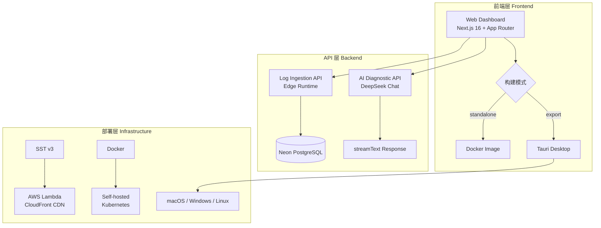

# 🚀 Omni-Sentinel

<div align="center">

[](https://nextjs.org/)
[](https://tauri.app/)
[](https://www.typescriptlang.org/)
[](LICENSE)

**下一代日志观测与 AI 诊断平台**

_Real-time Log Observability • AI-Powered Diagnostics • Multi-Platform Deployment_

</div>

---

## 🏗️ 架构概览



## 🛠️ 技术选型

| 层级         | 技术            | 选型理由                     |
| ------------ | --------------- | ---------------------------- |
| **前端框架** | Next.js 16      | App Router + RSC + Streaming |
| **边缘计算** | Edge Runtime    | 全球低延迟，Serverless       |
| **数据库**   | Neon PostgreSQL | HTTP 驱动，Serverless 友好   |
| **AI 引擎**  | DeepSeek Chat   | 高性价比中文模型             |
| **云部署**   | SST v3 (Ion)    | IaC，一键 AWS 部署           |
| **容器化**   | Docker + Alpine | 多阶段构建，< 300MB          |
| **桌面端**   | Tauri 2.0       | Rust 安全，< 10MB            |

## 📖 OpenSpec 驱动开发

本项目采用 **OpenSpec** 规格驱动开发模式，所有功能变更均经过提案审核、规格定义、任务拆分、实施验证的标准流程。

### 已归档变更

| 阶段    | 变更 ID                        | 功能描述          |
| ------- | ------------------------------ | ----------------- |
| Phase 1 | `add-dashboard-view`           | 仪表盘核心视图    |
| Phase 2 | `add-log-seeder`               | 测试数据生成器    |
| Phase 2 | `realtime-dashboard`           | 实时刷新功能      |
| Phase 3 | `integrate-vercel-ai-sdk`      | AI 智能诊断引擎   |
| Phase 3 | `complete-sidebar-modules`     | 侧边栏功能模块    |
| Phase 4 | `production-infra-setup`       | 生产级部署架构    |
| Phase 5 | `add-tauri-desktop-and-readme` | 桌面端 + 开源文档 |

> 📁 查看完整变更历史：[openspec/changes/archive/](./openspec/changes/archive/)

## 🚀 快速开始

### 环境要求

- Node.js 20+
- pnpm 10+
- PostgreSQL (可选，支持 Demo Mode)
- Rust toolchain (仅桌面端需要)

### 安装依赖

```bash
# 克隆仓库
git clone https://github.com/your-org/omni-sentinel.git
cd omni-sentinel

# 安装依赖
pnpm install
```

### 配置环境变量

```bash
# 复制环境变量模板
cp apps/web/.env.example apps/web/.env.local

# 编辑配置
# DATABASE_URL=postgresql://...  # Neon 连接串
# DEEPSEEK_API_KEY=sk-...        # AI API 密钥
```

### 启动开发服务器

```bash
# Web 开发模式
pnpm dev

# 访问 http://localhost:3000
```

## 🌐 部署指南

### Serverless 部署 (AWS)

```bash
# 配置 AWS 凭证
export AWS_ACCESS_KEY_ID=...
export AWS_SECRET_ACCESS_KEY=...

# 设置 SST Secrets
npx sst secret set DatabaseUrl "postgresql://..."
npx sst secret set DeepseekApiKey "sk-..."

# 部署到生产环境
pnpm deploy:cloud
```

### Docker 私有化部署

```bash
# 构建镜像
docker build -t omni-sentinel:latest .

# 运行容器
docker run -p 3000:3000 \
  -e DATABASE_URL="postgresql://..." \
  -e DEEPSEEK_API_KEY="sk-..." \
  omni-sentinel:latest
```

### 桌面端构建

```bash
# 安装 Rust (首次)
curl --proto '=https' --tlsv1.2 -sSf https://sh.rustup.rs | sh

# 构建桌面应用
pnpm build:desktop

# 产物位置
# macOS: apps/desktop/src-tauri/target/release/bundle/dmg/
# Windows: apps/desktop/src-tauri/target/release/bundle/msi/
# Linux: apps/desktop/src-tauri/target/release/bundle/deb/
```

## 📊 功能模块

| 模块          | 路由                  | 描述                 |
| ------------- | --------------------- | -------------------- |
| **Overview**  | `/dashboard`          | 系统概览，实时统计   |
| **Live Logs** | `/dashboard/logs`     | 全量日志流，分页查看 |
| **Database**  | `/dashboard/database` | 数据库连接状态       |
| **Security**  | `/dashboard/security` | API 密钥管理（脱敏） |
| **Settings**  | `/dashboard/settings` | AI 模型切换配置      |

## 🔌 API 端点

| 端点             | 方法 | 描述         |
| ---------------- | ---- | ------------ |
| `/api/v1/ingest` | POST | 日志数据摄入 |
| `/api/chat`      | POST | AI 诊断对话  |

### 日志摄入示例

```bash
curl -X POST http://localhost:3000/api/v1/ingest \
  -H "Content-Type: application/json" \
  -d '{
    "projectId": "my-app",
    "message": "Error: Connection timeout",
    "level": "error",
    "stackTrace": "at connect (db.ts:42)"
  }'
```

## 📄 许可证

[MIT License](LICENSE) © 2026 Omni-Sentinel Team

---

<div align="center">

**Built with ❤️ using OpenSpec-Driven Development**

</div>
