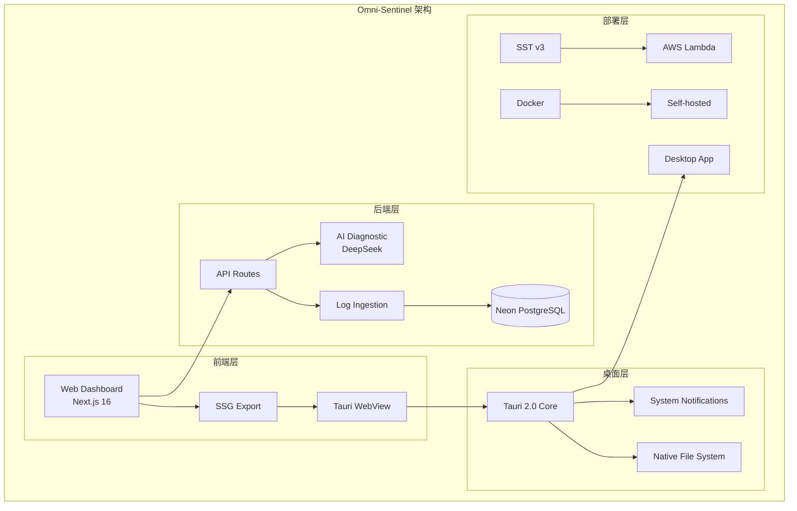

# 技术设计：add-tauri-desktop-and-readme

## 架构概览



## 项目结构

```
omni-sentinel/
├── apps/
│   ├── web/                    # 现有 Next.js 应用
│   │   └── next.config.ts      # [MODIFY] 支持 SSG export
│   └── desktop/                # [NEW] Tauri 桌面应用
│       ├── src-tauri/
│       │   ├── src/
│       │   │   └── lib.rs      # Rust 入口 + 通知功能
│       │   ├── Cargo.toml
│       │   └── tauri.conf.json
│       └── package.json
├── README.md                   # [NEW] 开源项目文档
└── package.json                # [MODIFY] 添加桌面端脚本
```

## 1. Tauri 2.0 集成方案

### 1.1 初始化配置

```bash
# 在 apps/desktop 初始化
pnpm create tauri-app@latest --template vanilla-ts
```

### 1.2 tauri.conf.json 核心配置

```json
{
  "productName": "Omni-Sentinel",
  "version": "1.0.0",
  "identifier": "com.omnisentinel.app",
  "build": {
    "frontendDist": "../web/out"
  },
  "app": {
    "windows": [
      {
        "title": "Omni-Sentinel",
        "width": 1280,
        "height": 800,
        "minWidth": 800,
        "minHeight": 600
      }
    ],
    "security": {
      "csp": "default-src 'self'; connect-src 'self' https://*.neon.tech https://api.deepseek.com"
    }
  },
  "plugins": {
    "notification": {}
  }
}
```

### 1.3 Rust 系统通知

```rust
// src-tauri/src/lib.rs
use tauri_plugin_notification::NotificationExt;

#[tauri::command]
fn show_notification(app: tauri::AppHandle, title: String, body: String) {
    app.notification()
        .builder()
        .title(&title)
        .body(&body)
        .show()
        .unwrap();
}

#[cfg_attr(mobile, tauri::mobile_entry_point)]
pub fn run() {
    tauri::Builder::default()
        .plugin(tauri_plugin_notification::init())
        .invoke_handler(tauri::generate_handler![show_notification])
        .run(tauri::generate_context!())
        .expect("error while running tauri application");
}
```

## 2. Next.js SSG 配置

### 2.1 修改 next.config.ts

```typescript
import type { NextConfig } from "next";

const isDesktopBuild = process.env.BUILD_TARGET === "desktop";

const nextConfig: NextConfig = {
  output: isDesktopBuild ? "export" : "standalone",

  // SSG 模式禁用图片优化（静态导出限制）
  images: isDesktopBuild
    ? {
        unoptimized: true,
      }
    : undefined,

  experimental: {
    serverMinification: true,
  },
};

export default nextConfig;
```

### 2.2 构建脚本

```json
{
  "scripts": {
    "build:web": "pnpm --filter web build",
    "build:desktop": "BUILD_TARGET=desktop pnpm --filter web build && pnpm --filter desktop build"
  }
}
```

## 3. README.md 结构提纲

```markdown
# Omni-Sentinel

> 🚀 下一代日志观测与 AI 诊断平台

## 架构图 (Mermaid)

[完整架构图]

## 技术选型

| 层级   | 技术            | 理由              |
| ------ | --------------- | ----------------- |
| 前端   | Next.js 16      | App Router + RSC  |
| 后端   | Edge Runtime    | 超低延迟          |
| 数据库 | Neon PostgreSQL | Serverless + HTTP |
| AI     | DeepSeek Chat   | 高性价比          |
| 部署   | SST v3 / Docker | 多模式            |
| 桌面   | Tauri 2.0       | 轻量原生          |

## OpenSpec 驱动开发

[OpenSpec 介绍 + 变更历史]

## 快速开始

[安装步骤]

## 部署指南

### Serverless (AWS)

### Docker

### Desktop

## 许可证

MIT
```

## 4. 与 Web 端的数据同步

**策略**：静态导出 + 远程 API

| 场景     | 处理方式                            |
| -------- | ----------------------------------- |
| 日志查看 | 通过远程 API 获取（需配置后端地址） |
| AI 诊断  | 调用远程 `/api/chat` 端点           |
| 离线模式 | 使用本地 SQLite（未来扩展）         |

## 5. 验证计划

1. **Web SSG**：`BUILD_TARGET=desktop pnpm build` 生成 `out/` 目录
2. **Tauri 构建**：`pnpm tauri build` 生成桌面应用
3. **通知测试**：调用 `show_notification` 命令验证系统通知
4. **README 验证**：GitHub 预览效果
